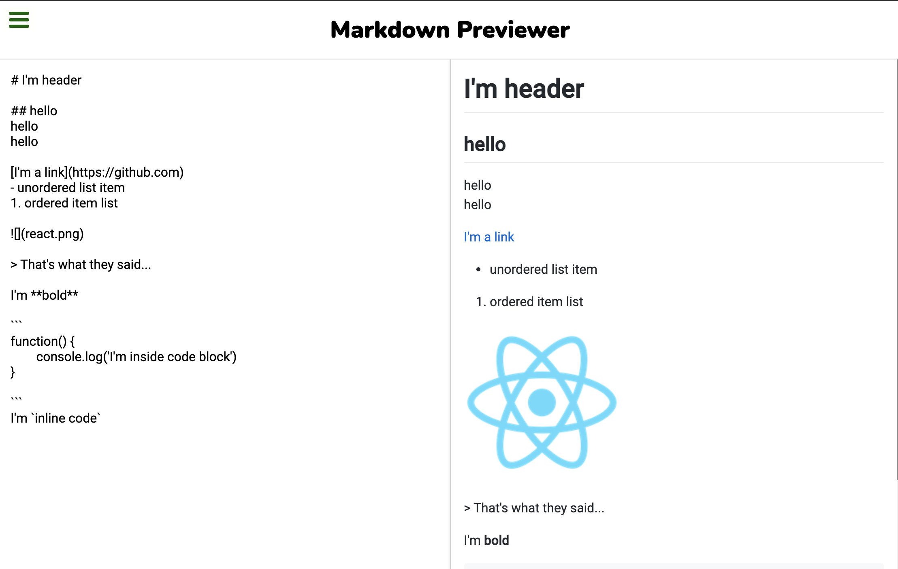

# Markdown previewer

Hi there! 👋

Thanks for visiting my markdown previewer repository. I made this based on [Front End Development Libraries Projects by freeCodeCamp](https://www.freecodecamp.org/learn/front-end-libraries/front-end-libraries-projects/build-a-markdown-previewer).

## Get started
First, visit [my markdown previewer](https://harryghgim.github.io/markdown/). There, type anything in markdown syntax in the left box, then it will be rendered accordingly in the right box. That's it!

## Skills
 

Also I used **[marked](https://github.com/markedjs/marked)**.

